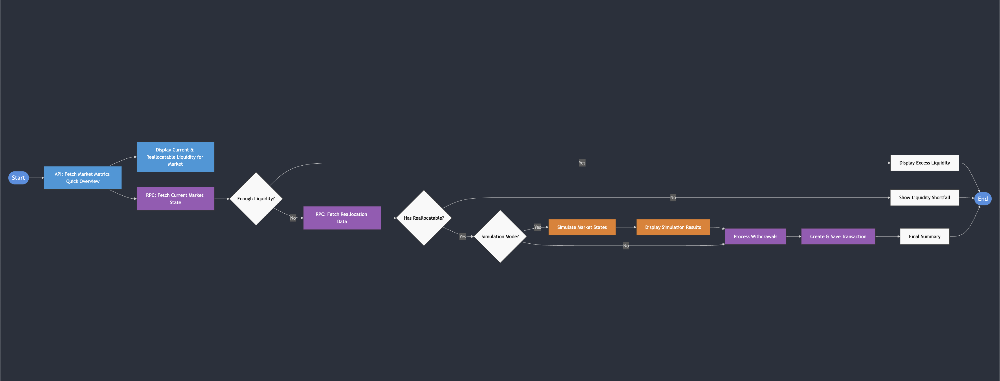

# Morpho Public Allocator - Bundler Implementation

This repository provides tools to fetch data from Morpho Blue markets and prepare reallocation transactions using the public allocator via the Bundler contract. The implementation supports Viem only for now.



## ⚠️ SDK Versions Notice

Current SDK versions are in pre-release. Use the following commands to install the latest next versions. Note the liquidity-sdk-viem is on version 1.1.0.

### For Viem Implementation

```bash
yarn add @morpho-org/blue-sdk@next
yarn add @morpho-org/blue-sdk-viem@next
yarn add @morpho-org/morpho-blue-bundlers@latest
yarn add @morpho-org/morpho-ts@next
yarn add @morpho-org/simulation-sdk@next
yarn add viem@^2.21.54
yarn add dotenv
```

and also:

```bash
yarn add @morpho-org/liquidity-sdk-viem@1.1.0
```

> **Note:** npm has potential issues parsing package names containing '@' symbols. We recommend using **yarn** or **pnpm** instead.  
> If one really needs to use **npm**, use exact versions in package.json:

## Environment Setup

Create a `.env` file in the root directory with the following variables:

```env
RPC_URL_MAINNET=your_mainnet_rpc_url_here
RPC_URL_BASE=your_base_rpc_url_here
```

## Performance Considerations

The script implements a two-step data fetching process for optimal performance:

1. **Initial Quick Overview**: Uses the Morpho API to fetch basic liquidity data

   - More efficient for initial checks
   - May have a ~1 minute delay
   - Suitable for UI displays and quick checks

2. **Detailed RPC Data**: Only fetched when reallocation is needed
   - More resource-intensive
   - Provides real-time data
   - Required for accurate transaction preparation

## Stack Choice

Currently only viem is supported, given a version dependency.

## Usage

1. Update the market parameters in your script:

```typescript
const chainId = 8453 as ChainId;
const marketId =
  "0x9103c3b4e834476c9a62ea009ba2c884ee42e94e6e314a26f04d312434191836" as MarketId;

// Example amounts: 20 USDC and 20M USDC
const examples = [
  { amount: 20, label: "20 USDC" },
  { amount: 20_000_000, label: "20M USDC" },
];
```

2. Run the script:

```bash
npx tsx scripts/sdks/viem/sdkBundler.ts
```

The script will:

1. Fetch initial market metrics from the GraphQL API
2. Get current market data and liquidity state
3. Calculate utilization and required reallocation
4. Process withdrawals if needed
5. Run market simulations for impact analysis
6. Generate transaction data if reallocation is required
7. Provide detailed results including:
   - Current market liquidity
   - API metrics
   - Simulation results
   - Reallocation details
   - Transaction data (if applicable)
   - Status messages

## Reallocation Flow

[Mermaid Link for preview](https://mermaid.live/view#pako:eNqNVVFP2zAQ_itWEBNIQQLKYM0DE4OxIUFV0e5hS_pwdS7EqmNnjqOuFP77HCdO0g6mtkp69n3f3fnz2V17VMboBV7C5ZKmoDSZfonERBvrILQ_s0NydHRJ7gTTDDh7xrAzyTVnKDT5QO4lxKhmkeg5K9oYFHCOfO0Mcouapq-RiAQxn3a6Al-N70LzBDWGPIBaoCYPqBWjxewNQo0IN-A3oGHmwptoprjGUzGugdOSg8awtcgj_i6ZwphcFQXqoiV3CMtMkS5-aMbX1Ys9g2ZSkEsyBfWE-nO7ov19MpJEoalS0hokEGMTPgedNpFdrCryy0i-kElJKRZFaKiPferIUpu1NyBbzlcRH4TmNTvsJd6gvpfuJxYvtcKP4-vQPE7vDXYjY0V3WJv3OxT3zOgVM71am0HHgjlH0vq2BeHO0aurH6tVYiTbuQ01NsM3pfXATpVe2rGSVi_1tiz_pLfKNKTQkfuqtE3Y-KqUE5bVDeUM127m9Gjsuql1t830AEbXdVfCbcn5ithZjDv9OmzXLalUOjF1hcZadqp0DtcxbmyzfkMx_ROaN6qqkKkCUQCtFjZ7J5lVxNIcwA7qhZdZBmoV3jIB3I3aTrWj7T2hHIriBhMSYwIl1yRhnAd7ybD6-oVWcoHB3mAw8KnkUgVzDnSxRWUiLx3xDIbHePoGcZkyjVvEvNm0mnqKlF6c7EiFnDW0wdnwUzzfkaZy2tCG84_D-fmONFrtgZPmhJ4dJztKU9QtVnV5zcbzCzz9jz49PrGXvW82q1a47zK3qN80tVGi73FXg98etZz2_e3N4_cPm9_rMrvYjTrcOelWEwnP9zJUGbDY_FetK3jk6RQzjLzAmLEpLvIi8WpwUGo5WQnqBVqV6HtKlk-pF5hDUJhRmccm9g2DJwWZg-QgfkmZNaDXv0uBZvo)

## Note

- API data has a potential 1-minute delay
- Reallocatable liquidity calculations consider utilization caps (92% max)
- For support, reach out on [Discord](https://discord.morpho.org)

## License

This project is licensed under the MIT License.
