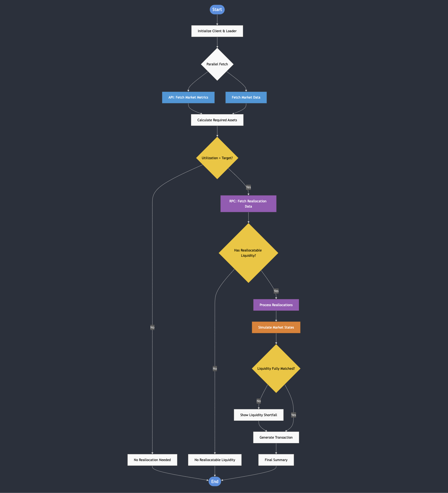

# Morpho Public Allocator - Bundler Implementation

This repository provides tools to fetch data from Morpho Blue markets and prepare reallocation transactions using the public allocator via the Bundler contract. The implementation supports both Ethers.js and Viem for maximum flexibility.



## ⚠️ SDK Versions Notice

Current SDK versions are in pre-release. Use the following commands to install the latest next versions:

### For Ethers.js Implementation

```bash
yarn add @morpho-org/blue-sdk@next
yarn add @morpho-org/blue-sdk-ethers@next
yarn add @morpho-org/liquidity-sdk-ethers@next
yarn add @morpho-org/morpho-blue-bundlers@latest
yarn add @morpho-org/morpho-ts@next
yarn add @morpho-org/simulation-sdk@next
yarn add ethers@^6.13.1
yarn add dotenv
```

### For Viem Implementation

```bash
yarn add @morpho-org/blue-sdk@next
yarn add @morpho-org/blue-sdk-viem@next
yarn add @morpho-org/liquidity-sdk-viem@next
yarn add @morpho-org/morpho-blue-bundlers@latest
yarn add @morpho-org/morpho-ts@next
yarn add @morpho-org/simulation-sdk@next
yarn add viem@^2.21.54
yarn add dotenv
```

## Environment Setup

Create a `.env` file in the root directory with the following variables:

```env
RPC_URL_MAINNET=your_mainnet_rpc_url_here
RPC_URL_BASE=your_base_rpc_url_here
```

## Performance Considerations

The script implements a two-step data fetching process for optimal performance:

1. **Initial Quick Overview**: Uses the Morpho API to fetch basic liquidity data

   - More efficient for initial checks
   - May have a ~1 minute delay
   - Suitable for UI displays and quick checks

2. **Detailed RPC Data**: Only fetched when reallocation is needed
   - More resource-intensive
   - Provides real-time data
   - Required for accurate transaction preparation

## Stack Choice

Both Ethers.js and Viem implementations provide identical functionality. Choose based on your existing stack:

- Use Ethers.js version if you're already using Ethers.js in your project
- Use Viem version if you're using Viem or starting a new project

## Usage

1. Update the market parameters in your script:

```typescript
const marketId = "0x..." as MarketId; // Your target market
const chainId = 1; // or 8453 for Base
const REQUESTED_LIQUIDITY = BigInt("1000000000000000000"); // Amount in wei
```

2. Run the script:

```bash
ts-node scripts/ethers/sdkBundler.ts
```

or

```bash
ts-node scripts/viem/sdkBundler.ts
```

The script will:

1. Fetch initial market metrics from the API
2. Check current market liquidity
3. Determine if reallocation is needed
4. Optional: Run market state simulations
5. Process withdrawals if needed
6. Generate and save transaction data to `rawTransaction.json`

## Reallocation Flow


## Note

- API data has a potential 1-minute delay
- Reallocatable liquidity calculations consider utilization caps (92% max)
- For support, reach out on [Discord](https://discord.morpho.org)

## License

This project is licensed under the MIT License.
